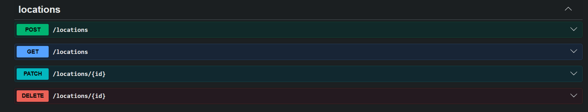

# Location Manager

organize your locations on a minimalistic map!

# Important note!

While I am comfortable with React and TanStack Query, many of the other technologies used in this project are quite new to me. I've done my best to implement them, and I would appreciate it if you could keep this in mind during the review. I'm very open to any feedback on how I can improve.

# Setup and run instructions

### 1. Database

Install the latest version of Docker on your computer. Run the MongoDB server from the root directory:

docker compose up -d

Stop the database with (run in root directory):

docker compose down

### 2. Backend

Navigate to the server directory, install dependencies, and start the development server:

cd server
npm i
npm run start:dev

stop with:
press Ctrl + C in terminal

### 3. Frontend

Navigate to the locations-frontend directory, install dependencies, and start the application:

cd locations-frontend
npm i
npm run dev

stop with:
press Ctrl + C in terminal

## Agenda (before starting to work on project)

After reading the assignment, it seems 8 hours aren't enough, especially since my Nest.js experience is close to none (working daily with FastAPI). That's gonna be a problem worth considering.

Luckily, I was sick yesterday so I worked with Nest.js a bit, so I have code I could be inspired by.

I'll cut the work to two parts of time management:
backend: 3.5 hours (till 14:00)
front till break (approximately an hour)
break at around 15:00 - 16:00
frontend: 2.5 hours (till 18:30)
finishes and fixes: 1 hour (till 19:30)

I'll put here things i think i wont have time for **probably**:

pagination
Address → Coordinates problem! Coordinates are mandatory on creation so where does it come handy?
Cache results and rate limits
Clicking a marker highlights the list item and vice versa

## Time spent and cut corners

After spending about seven hours and 30 minutes, my pinky finger started hurting unusually. The pain began at 18:50 so i had to stop writing (hand over to AI at form parts **only**. because of the pain and luck of time)

cut corners:

no cache
basic error handling for the external API
no Address → Coordinates because it's mandatory on creation of a new location
no tests
no clicking on map for adding new location. only manually.
no optimistic update for create/delete
no Show loading and error states with retries

started to have headaches at 19:00. not feeling to good... but i think everything will be ok :).

## Trade-offs and assumptions

sorry my hand really hurts. i'll let you know later. but at least cleanup on front and back.

## Images:

## Notes i wrote during development

sources:

NestJS Course for Beginners - Build Server-Side Applications

- https://www.youtube.com/watch?v=21_I-12f5JE

docs - https://docs.nestjs.com

mongodb docker - https://hub.docker.com/_/mongo
connect volume - https://stackoverflow.com/questions/34390220/how-to-mount-external-volume-for-mongodb-using-docker-compose-and-docker-machine
another conf exemple:https://www.mongodb.com/docs/atlas/cli/current/atlas-cli-docker-compose/

connect mongo to nestjs, configuration - https://docs.nestjs.com/techniques/mongodb

connection settings - https://stackoverflow.com/questions/72460269/how-to-read-a-env-file-on-mongoosemodule-in-nestjs

uri assembly - https://mongoosejs.com/docs/connections.html

openapi spec basic - https://docs.nestjs.com/openapi/introduction#bootstrap
use nestjs-zod for openapi spec benefits - https://www.npmjs.com/package/nestjs-zod?ref=amarjanica.com

remove ts error in sceama - https://stackoverflow.com/questions/49699067/property-has-no-initializer-and-is-not-definitely-assigned-in-the-construc

HydratedDocument for type with methods - https://mongoosejs.com/docs/typescript.html

point type mongo for cordinante - https://www.mongodb.com/docs/manual/reference/geojson/#std-label-geospatial-indexes-store-geojson (not used at the end to messy)

implementaiton in moongoos - https://mongoosejs.com/docs/geojson.html (not used at the end to messy)

integration with moongoos for service queries - https://docs.nestjs.com/techniques/database#models

update with mongoose - https://mongoosejs.com/docs/api/model.html#Model.findByIdAndUpdate()

remove \_\_v from mongo schema - https://stackoverflow.com/questions/13699784/mongoose-v-property-hide

z.date() to json issue - https://github.com/nestjs/swagger/issues/3672
zod lengths validations - https://tecktol.com/zod-length-constraints

response types for swagger - https://docs.nestjs.com/openapi/operations#responses

improve error handeling - https://zod.dev/error-customization

validate object id with nongoose - https://mongoosejs.com/docs/api/mongoose.html#Mongoose.prototype.isValidObjectId() - no time for creating pipe and dint find exsisting one

pagination - https://stackoverflow.com/questions/12542620/how-to-make-pagination-with-mongoose

zod sting to int iisue -https://github.com/colinhacks/zod/discussions/330

test spec issue - https://stackoverflow.com/questions/54139158/cannot-find-name-describe-do-you-need-to-install-type-definitions-for-a-test?page=1&tab=scoredesc#tab-top

call externalAPI - https://docs.nestjs.com/techniques/http-module#installation
https://docs.nestjs.com/techniques/http-module#full-example

coords to adress endpint - https://stackoverflow.com/questions/66506483/how-to-get-the-address-from-coordinates-with-open-street-maps-api

manual - https://nominatim.org/release-docs/latest/api/Reverse/

cashing for address: https://docs.nestjs.com/techniques/caching#in-memory-cache

convert json to dto of external api - https://qaribhaider.github.io/nestjs-json-to-response-dto/

basic logger - https://docs.nestjs.com/techniques/logger#using-the-logger-for-application-logging

cors - https://github.com/expressjs/cors (redirect form nest docs)

thots:

didnt use filters. i know they exsist but dont have experianse with them... so cathcing errors in service
external api worth more points. go for it instead of tests
didnt find normal sceama for response from external api. used my preservation from reesponse
on 18:30 sharp pain in pinky. slows me down

stoped at 14:30 for lunch
continue at 16:30 didnt feel so well
************************************************\_\_\_************************************************front:

recomended by openlayers - https://openlayers.org/3rd-party/ -> https://github.com/allenhwkim/react-openlayers - not used at the end

orval - https://orval.dev/docs/guides/client-with-zod/
react query basic app.tsx conf - https://dev.to/thwani47/building-a-crud-app-with-react-query-typescript-and-axios-2d0j

baseline css desine - https://mui.com/material-ui/react-css-baseline/
conf pritter -https://prettier.io/docs/configuration

basic map - https://openlayers.org/en/latest/examples/accessible.html

taged map - https://openlayers.org/en/latest/examples/icon-color.html
list -https://mui.com/material-ui/react-list/
