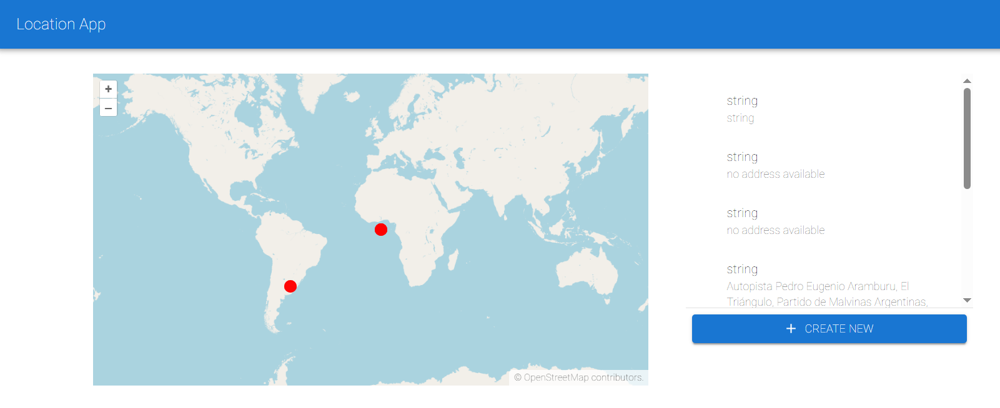
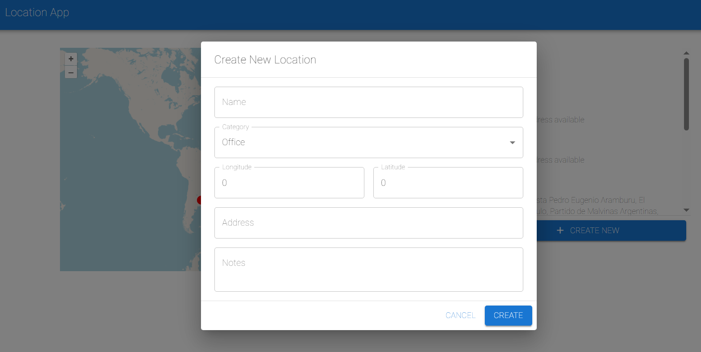
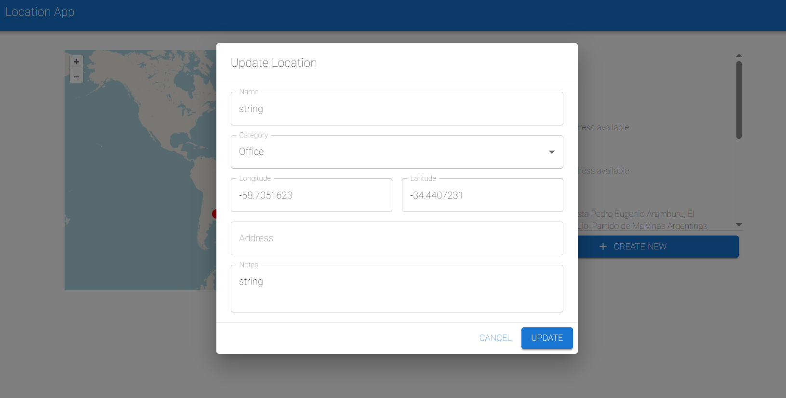

# Location Manager

organize your locations on a minimalistic map!

# Important note!

While I am comfortable with React and TanStack Query, many of the other technologies used in this project are quite new to me. I've done my best to implement them, and I would appreciate it if you could keep this in mind during the review. I'm very open to any feedback on how I can improve.

# Setup and run instructions

### 1. Database

Install the latest version of Docker on your computer. Run the MongoDB server from the root directory:

docker compose up -d

Stop the database with (run in root directory):

docker compose down

### 2. Backend

Navigate to the server directory, install dependencies, and start the development server:

cd server
npm i
npm run start:dev

stop with:
press Ctrl + C in terminal

### 3. Frontend

Navigate to the locations-frontend directory, install dependencies, and start the application:

cd locations-frontend
npm i
npm run dev

stop with:
press Ctrl + C in terminal

## Agenda (before starting to work on project)

After reading the assignment, it seems 8 hours aren't enough, especially since my Nest.js experience is close to none (working daily with FastAPI). That's gonna be a problem worth considering.

Luckily, I was sick yesterday so I worked with Nest.js a bit, so I have code I could be inspired by.

I'll cut the work to two parts of time management:
backend: 3.5 hours (till 14:00)
front till break (approximately an hour)
break at around 15:00 - 16:00
frontend: 2.5 hours (till 18:30)
finishes and fixes: 1 hour (till 19:30)

I'll put here things i think i wont have time for **probably**:

pagination
Address → Coordinates problem! Coordinates are mandatory on creation so where does it come handy?
Cache results and rate limits
Clicking a marker highlights the list item and vice versa

## Time spent and cut corners

After spending about seven hours and 30 minutes, my pinky finger started hurting unusually. The pain began at 18:50 so i had to stop writing (hand over to AI at form parts **only**. because of the pain and luck of time)

cut corners:

no cache
basic error handling for the external API
no Address → Coordinates because it's mandatory on creation of a new location
no tests
no clicking on map for adding new location. only manually.
no optimistic update for create/delete
no Show loading and error states with retries

started to have headaches at 19:00. not feeling to good... but i think everything will be ok :).

## Trade-offs and assumptions

sorry my hand really hurts. i'll let you know later. but at least cleanup on front and back.

## Images:

